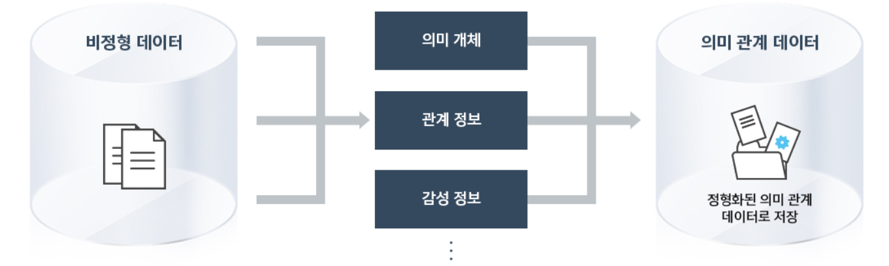
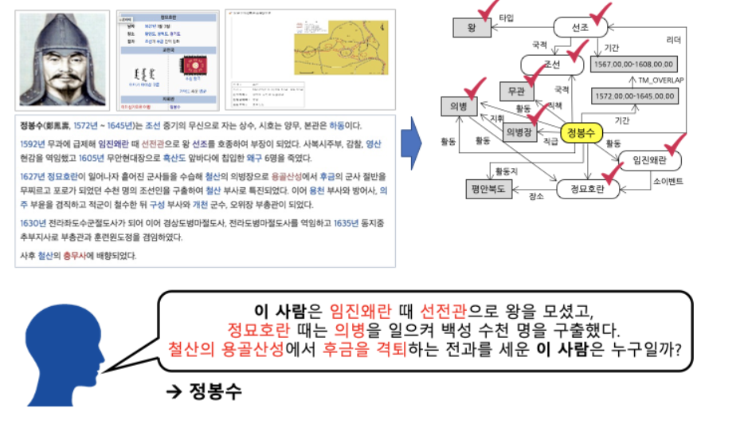
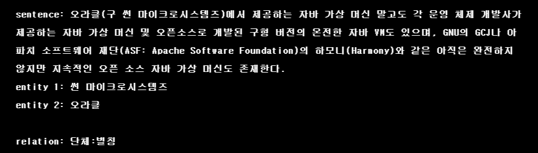

# Pstage02 (KLUE) Relation extraction


## training
```bash
python train.py
```


## inference

```bash
python inference.py --model_dir=[model_path]
```


## Summary


### Final LeaderBoard

**80.7%** (Accuracy)

**16th** / 135


### Abstract

비구조적인 자연어 문장에서 구조적인 triple을 추출해 정보를 요약하고, 중요한 성분을 핵심적으로 파악하는 것은 매우 중요합니다.

그 중에서도 관계 추출(Relation Extraction)이란 문장의 단어(Entity)에 대한 속성과 관계를 예측하는 문제로서 구조화된 검색, 감정 분석, 질문 답변하기, 요약과 같은 자연어처리 응용 프로그램에서 핵심 구성 요소입니다.





아래 그림의 예시와 같이 요약된 정보를 사용해 QA 시스템 구축과 활용이 가능하며, 이외에도 요약된 언어 정보를 바탕으로 효율적인 시스템 및 서비스 구성이 가능합니다.




이 대회에서는 특히 Sentence, Entity, Relation에 대한 정보를 통해 ,문장과 엔티티 사이의 관계를 추론하는 모델을 학습시킵니다. 이를 통해 우리의 인공지능 모델이 Entity들의 속성과 관계를 파악하며 개념을 학습할 수 있습니다.



### Role

- 다양한 Data Preprocessing (frequency 체크 후, 특수기호 중심 전처리)

- Pororo, Papago, Google Translator 등을 이용한 Back Translation

  <a href="./TestPreProcessing_PororoTagging.ipynb" target="blank">DataPreProcessing & Augmentation </a>

  <a href="./네이버번역기이용Augmnetation.ipynb" target="blank">PaPago Translation </a>

- 외부 데이터 활용

  <a href="./가져온_외부파일_살펴보기.ipynb" target="blank">External Data </a>

- Neptune 활용 위한 각종 Log 정보 저장

  <a href="./customized_confusion_matrix.py" target="blank">ConfusionMatrix </a>

  <a href="./k_th_plot_from_logs.py" target="blank">Plot for lr & acc & loss </a>

- Various PLM Models from Huggingface 
- K-Fold Ensemble

